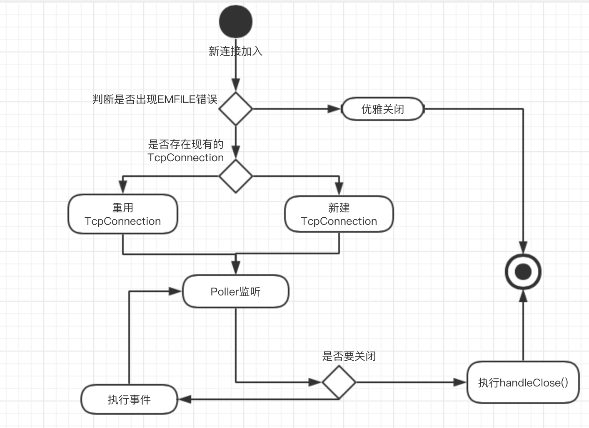

# netlib
轻量级网络协议库

## 运行逻辑

## 主要组成部分

#### Eventloop:

``负责IO事件的执行``, 每个线程都有一个Eventloop, 由``Acceptor``的``newConnection函数``进行负载均衡. 在loop()函数中通过调用poller_的``poll()``函数来获取就绪事件并保存到``activeChannels``，然后遍历activeChannels并执行它的``handleEvent()函数``

#### Poller:

Eventloop的成员，使用``epoll``来负责具体的IO多路复用. 并且提供将Channel加入到epoll监听队列等功能.

#### Channel:

以fd为核心的包装类, 提供``handleRead等回调函数``, 是Eventloop和TcpConnection沟通的``桥梁``. TcpConnection通过调用其``handleEvent()``来执行IO操作.

#### TcpConnection:

逻辑上的socket连接, 每一个socket都对应着一个TcpConnection, 它通过``回调函数``来完成业务逻辑的实现. 因为Server保存的shared_ptr, 所以``TcpConnection的生存周期``由用户来决定.

#### Acceptor

接收socket连接的类, 在接收到一个连接之后, 调用newConnection来创建一个TcpConnection(或重用). 采用``轮换``的思想将其绑定在某一个EventloopThread上, 以此来完成``多工作线程负载均衡``.

#### Server

负责着整个服务器的启动和终止, 并在此注册回调函数.

## 使用方法:
提供回调函数来实现业务逻辑

 - ConnectionStatusCallBack ``状态更改回调函数``
    
    当连接的socket状态更改时,会执行此回调函数

 - ClosingCallBack ``socket关闭回调函数``

    当socket即将关闭时, 会执行次回调函数, 可以用于进行注销用户等功能

 - ReadCompleteCallBack ``读结束回调函数``

    当读完Socket的数据之后, 会执行此回调函数, 可以用于处理数据等功能

 - WriteCompleteCallBack ``写结束回调函数``

    当服务器给socket写完数据之后, 会执行此回调函数, 可以用于记录发送数据日志等功能

 - ErrorCallBack ``出错回调函数``

    当出现错误时, 会执行此回调函数, 默认忽略, 如有需要, 可以记录出错信息

使用make可以生成用例

## 性能
Concurrency Level:      20

Time taken for tests:   3.339 seconds

Complete requests:      100000

Failed requests:        0

Requests per second:    29953.30 [#/sec] (mean)

Time per request:       0.033 [ms] (mean, across all concurrent requests)

Device: MacBook Pro (13-inch, 2018, Four Thunderbolt 3 Ports)

System: 4.15.0-30deepin-generic

Time: 2019/12/01